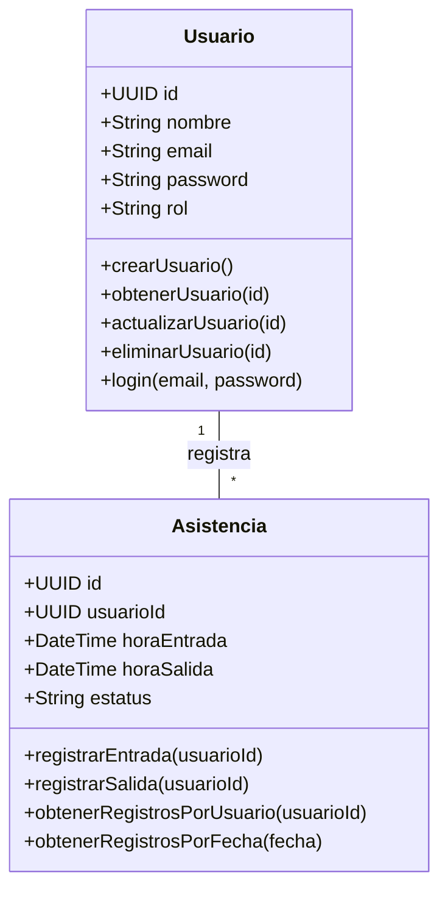
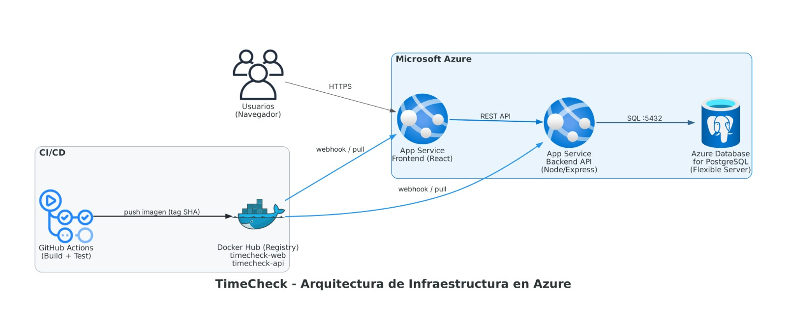

# Propuesta de Proyecto Final: Sistema de Registro de Asistencia (TimeCheck)

**Materia:** Infraestructura para el Desarrollo Continuo  
**Repositorio:** [https://github.com/DiegoGomez12/ProyectoIDC](https://github.com/DiegoGomez12/ProyectoIDC)  
**Wiki:** [https://github.com/DiegoGomez12/ProyectoIDC/wiki](https://github.com/DiegoGomez12/ProyectoIDC/wiki)  
**Integrantes:**
* **Nestor Eduardo Perez Avalos**
* **Diego Alonso Gomez Yañez**
* **Hector Alfonso Sandoval Bautista**
  
---

## 1. Descripción del Proyecto
**TimeCheck** es una plataforma web diseñada para registrar entradas y salidas (*Check-in / Check-out*) de personal o estudiantes. El objetivo principal de este proyecto es implementar y demostrar el ciclo de vida completo de Integración y Despliegue Continuo (CI/CD) aplicando metodologías DevOps, contenerización de microservicios lógicos, automatización de pruebas unitarias e Infraestructura como Código (IaC) en la nube.

---

## 2. Componentes y Métodos
El sistema se organiza en tres componentes funcionales clave:

* **Componente de Usuarios (Employees/Admin):** Gestión de autenticación, roles y perfiles de usuario.
* **Componente de Asistencias (Records):** Lógica de negocio para el registro de marcas de tiempo (*Check-in* / *Check-out*).
* **Componente de Reportes (Operations):** Consultas operativas para listar registros diarios y calcular el total de horas trabajadas.

### Diagrama de Clases (Métodos CRUD)

---

## 3. Stack Tecnológico
Para garantizar la entrega continua y el rendimiento del pipeline, se seleccionó el siguiente conjunto de tecnologías:

| Capa | Tecnología | Descripción |
| :--- | :--- | :--- |
| **Frontend** | React.js | Single Page Application (SPA) responsiva. |
| **Backend** | Node.js / Express | API RESTful ágil para la gestión de peticiones. |
| **Base de Datos** | PostgreSQL | Persistencia relacional de datos. |
| **Contenedores** | Docker & Docker Compose | Contenerización y orquestación local de servicios. |
| **CI/CD** | GitHub Actions | Automatización de compilación, pruebas y despliegue. |
| **Cloud Provider** | Microsoft Azure | Hosting y servicios gestionados en la nube. |

---

## 4. Recursos de Infraestructura y Deployment
Se provisionarán los siguientes recursos gestionados en Microsoft Azure:

* **Azure App Service (Web App for Containers):** Dos instancias independientes para ejecutar los contenedores de Frontend y Backend.
* **Azure Database for PostgreSQL (Flexible Server):** Instancia administrada para la base de datos relacional.
* **Docker Hub:** Registro público donde GitHub Actions compila y almacena las imágenes de los contenedores.

### Diagrama de Arquitectura de Infraestructura (Azure)

> **Flujo de Integración:** GitHub Actions compila e inspecciona el código → Empuja las imágenes etiquetadas a **Docker Hub** → Dispara el webhook hacia **Azure App Service** → Las aplicaciones consumen datos de **Azure Database for PostgreSQL**.

---

## 5. Pruebas Unitarias
El pipeline de CI bloqueará automáticamente cualquier despliegue que no apruebe la suite de pruebas:

* **Backend (Jest & Supertest):**
  * Verificación de restricciones de negocio: impedir un *Check-in* si existe uno activo sin *Check-out*.
  * Validación de cálculo preciso de horas trabajadas entre marcas de tiempo considerando zonas horarias.
* **Frontend (React Testing Library):**
  * Evaluación de renderizado condicional en interfaz (alternar visibilidad del botón *Check-out* solo tras un *Check-in* exitoso).

---

## 6. Docker Hub y Contenedorización
El proyecto adopta un enfoque *Cloud Native* mediante:

1. **Multi-stage Builds:** Dockerfiles independientes optimizados para reducir el peso de las imágenes finales de producción.
2. **Orquestación Local:** Archivo `docker-compose.yml` que levanta la base de datos PostgreSQL, el backend y el frontend en una red aislada.
3. **Publicación Automática:** Automatización en GitHub Actions para autenticarse en Docker Hub y subir las imágenes (`usuario/timecheck-api`, `usuario/timecheck-web`) etiquetadas con el SHA del commit correspondiente.

---

## 7. Estrategia de Ramas (GitHub Flow)
Se implementa **GitHub Flow** para soportar el ciclo de entrega continua:

* `main`: Rama protegida de producción. Cada *merge* aprobado dispara el despliegue automático a Azure App Service.
* `develop`: Rama de integración donde se ejecutan pruebas en entornos de *Staging*.
* `feature/[nombre]`: Ramas cortas creadas desde `develop` para la construcción de nuevos endpoints, componentes o configuraciones.

---

## 8. Plan de Trabajo (Backlog e Issues)

**Tablero GitHub Project Board:** [Plan de Trabajo - ProyectoIDC](https://github.com/users/DiegoGomez12/projects/1)

### Fase 1: Infraestructura y Contenedores Base
* **Issue 1:** Configurar repositorio, `.gitignore`, rama `main` y reglas de protección.
* **Issue 2:** Crear Dockerfiles optimizados para el Backend y el Frontend.
* **Issue 3:** Crear `docker-compose.yml` para entorno de desarrollo local con PostgreSQL.

### Fase 2: Desarrollo del Backend y Pruebas
* **Issue 4:** Desarrollar API CRUD para la gestión de Usuarios.
* **Issue 5:** Desarrollar API para Registro de Asistencias (Check-in/Check-out).
* **Issue 6:** Implementar pruebas unitarias con Jest para validaciones de tiempo y negocio.

### Fase 3: Integración Continua (CI)
* **Issue 7:** Configurar flujo en GitHub Actions para ejecución automática de pruebas en Pull Requests.
* **Issue 8:** Configurar paso de construcción de imágenes Docker y push automático a Docker Hub.

### Fase 4: Desarrollo del Frontend
* **Issue 9:** Desarrollar módulo de autenticación e interfaz de Login.
* **Issue 10:** Desarrollar Dashboard con paneles interactivos de Entrada/Salida.

### Fase 5: Despliegue en Azure (CD)
* **Issue 11:** Provisionar la instancia de Azure Database for PostgreSQL.
* **Issue 12:** Configurar Azure App Services y Webhooks de Docker Hub para despliegue continuo.